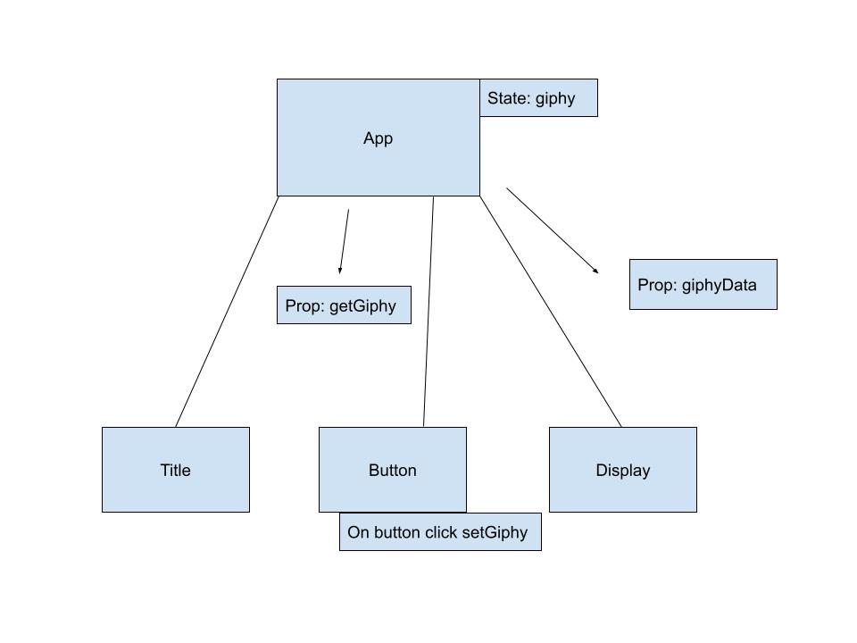

# [React Giphy API](https://github.com/germanokuerten/react-giphy-api/)
<!-- (https://ondarox-manager.herokuapp.com/) -->

Click on the button and retrieve a random giphy.

## Technologies

- HTML5
- CSS3
- JavaScript ES6
- Node.js
- React

## Diagram

Home            | 
:-------------------------:|
  |

**Summary**

| Field | Detail |
|-------|--------|
| App Name | React Giphy API |
| Description | React Giphy API allows you to retrieve a random gif for personal enjoyment |
| Developers | Germano Kuerten |
| Repo | https://github.com/germanokuerten/react-giphy-api |

>"Simplicity Is the key to brilliance." - Bruce Lee